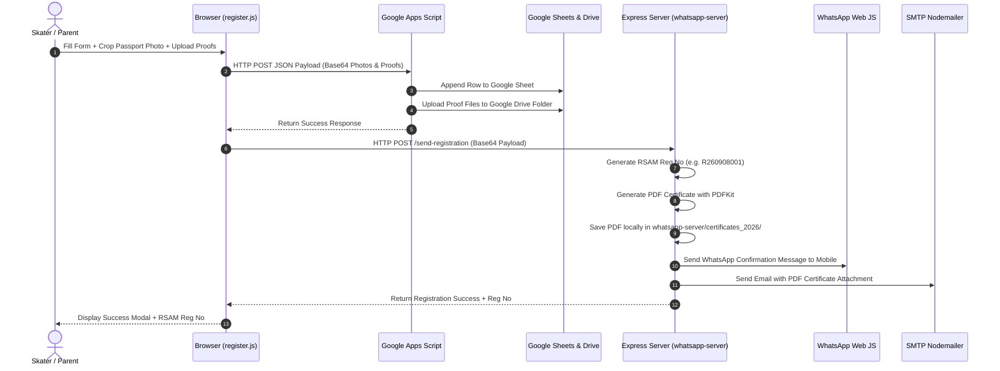

# Roller Sports Association Moradabad (RSAM)
## Developer & Administrator Guide

This guide provides technical specifications, codebase architecture, data schemas, API documentation, and step-by-step instructions for developers and site administrators managing the RSAM web platform.

---

### 1. Technical Stack & Architecture

- **Frontend**: Modular Single Page Application (SPA) built with Vanilla JavaScript (ES6+), HTML5, CSS3 (CSS Variables, Flexbox, Grid), and dynamic DOM mounting (`mount()` engine in `render.js`).
- **Backend API**: Node.js + Express server (`whatsapp-server/server.js`) handling:
  - Dynamic Cloudinary Admin API subfolder discovery & resource queries.
  - PDF Certificate generation using `PDFKit`.
  - Automated WhatsApp notifications via `whatsapp-web.js` (Puppeteer Chrome automation).
  - Automated Email delivery with PDF attachments via `Nodemailer`.
- **Database / Registration Storage**: Google Sheets API via Google Apps Script (`google-apps-script.js`) for serverless registration storage, alongside local PDF certificate archives.
- **Media Cloud**: Cloudinary (`rsam_website/` root directory) for high-performance image CDN, automatic format conversion (`f_auto`), and dynamic quality optimization (`q_auto`).

---

### 2. Directory & File Structure

```
rsam-website/
├── index.html                  # Main SPA container & layout
├── register.html               # Skater Annual Registration Form page
├── register.js                 # Registration form validation, cropper, & submission logic
├── register.css                # Registration styling & responsive layout
├── config.js                   # Site configuration, section toggles, social links
├── render.js                   # Core frontend renderer (Gallery, News, Cert, Video, etc.)
├── script.js                   # Navigation, smooth scroll, search modal, connect form
├── styles.css                  # Global website stylesheet & CSS design tokens
├── USER-GUIDE.md               # End-User Guide for athletes & parents
├── DEVELOPER-GUIDE.md          # Technical documentation & admin guide (this file)
│
├── data/                       # Config JSON files (Editable by Developers/Admins)
│   ├── news-items.json         # News releases & announcements
│   ├── upcoming-events.json    # Upcoming championships & selection trials
│   ├── highlights.json         # National/State medalist achievements
│   ├── officials.json          # RSAM executive body & coaches directory
│   ├── affiliations.json       # UPRSA & RSFI affiliation credentials
│   ├── gallery-config.json     # Gallery album titles, order, & Cloudinary subfolder paths
│   ├── gallery.json            # Static fallback album photos array
│   └── cloudinary-media-map.json # Direct Cloudinary URL overrides
│
├── whatsapp-server/            # Node.js Express Backend & WhatsApp Bot
│   ├── server.js               # Main API routes, PDF generator, Nodemailer, WhatsApp client
│   ├── chest-counter.json      # Counter state file for registration numbers (R26yymmddSeq)
│   ├── certificates_2026/      # Generated PDF certificates local storage
│   └── .env                    # Cloudinary & SMTP environment variables
│
└── google-apps-script.js       # Apps Script code to paste into Google Sheets Script Editor
```

---

### 3. How Developers Make Data Entries

Developers and administrators can update content across the website by editing JSON files under `data/` or uploading media to Cloudinary.

#### A. Adding News Items (`data/news-items.json`)
Add a new object to the `items` array:
```json
{
  "id": "trial-notice-oct-2026",
  "category": "Trial Notice",
  "title": "4th District / State Selection Trial Announcement",
  "date": "September 15, 2026",
  "summary": "Official circular for selection trials on October 4, 2026 in Moradabad.",
  "fullContent": "Full text of the announcement...",
  "image": "https://res.cloudinary.com/igjmhsju/image/upload/v1788797356/rsam_website/news/notice-oct.png",
  "badge": "NEW"
}
```

#### B. Adding Upcoming Events (`data/upcoming-events.json`)
Add a new event object to the `events` array:
```json
{
  "image": "https://res.cloudinary.com/igjmhsju/image/upload/v1788797356/rsam_website/events/event-state.png",
  "category": "State Championship",
  "startDateTime": "2026-10-23T06:00",
  "endDateTime": "2026-10-26T20:00",
  "date": "October 23–26, 2026",
  "location": "Devaswom Skating Track, GB Nagar",
  "title": "12th UP State Roller Skating Championship 2026",
  "body": "The 12th UP State Championship hosted at Devaswom Skating Track, GB Nagar.",
  "linkText": "Download Circular",
  "linkHref": "#"
}
```

#### C. Adding Highlights (`data/highlights.json`)
Add a new item object:
```json
{
  "id": "vedanga-gold-2026",
  "title": "Vedanga Sharma Wins Gold at RSFI Nationals",
  "athlete": "Vedanga Sharma",
  "achievement": "Gold Medal – Speed Skating (Inline 500m)",
  "date": "March 2026",
  "image": "https://res.cloudinary.com/igjmhsju/image/upload/v1788797476/rsam_website/highlights/vedanga-medal.png",
  "description": "Proud moment for RSAM Moradabad..."
}
```

#### D. Updating Officials Directory (`data/officials.json`)
Add or edit official profile objects:
```json
{
  "name": "Official Name",
  "role": "District Coach / Executive Member",
  "designation": "Certified RSFI Coach",
  "phone": "+91 98765 43210",
  "email": "official@rsam.org",
  "image": "https://res.cloudinary.com/igjmhsju/image/upload/v1788797356/rsam_website/officials/official-photo.png"
}
```

#### E. Configuring Gallery Albums (`data/gallery-config.json`)
To add rich metadata (custom title, date, location) for a Cloudinary subfolder:
```json
{
  "folderId": "state-championship-2026",
  "cloudinarySubfolder": "rsam_website/gallery/lko_uprsa_7th_2026",
  "title": "UP State Championship – Lucknow 2026",
  "date": "May 10, 2026",
  "location": "Central Academy, Lucknow",
  "category": "State Championship",
  "enabled": true,
  "displayOrder": 1,
  "description": "High-octane moments and victory celebrations."
}
```
*Note: If a subfolder exists on Cloudinary under `rsam_website/gallery/<subfolder_name>` but is not defined in `gallery-config.json`, the website automatically discovers it live and generates a clean title from its folder name!*

---

### 4. Skater Registration Data Flow & Submission Architecture

When a skater submits the registration form on `register.html`:



#### Summary of Where Entries & Documents are Saved:

1. **Google Sheets / Database Records**:
   - Submission endpoint: Google Apps Script Web App URL (`SHEET_URL` in `register.js`).
   - Every registration populates a row with columns: `Timestamp`, `Year`, `Skater Name`, `DOB`, `Age`, `Father Name`, `Mother Name`, `Address`, `Mobile`, `Email`, `Aadhaar`, `Discipline`, `Skater Photo Link`, `Aadhaar Proof Link`, `DOB Proof Link`, `Payment Ref No`.

2. **Uploaded Document Proofs (Aadhaar & DOB Proof)**:
   - Base64 payload transmitted via POST.
   - Google Apps Script creates PDF / image files inside the designated **Google Drive Folder** linked to the script and writes the file view links back into the Google Sheet.

3. **Generated PDF Registration Certificates**:
   - Express server (`whatsapp-server/server.js`) generates an A4 PDF certificate featuring RSAM branding, QR verification code, cropped passport photo, and registration details.
   - **Local Storage Path**: `whatsapp-server/certificates_2026/<RegNo>_<SkaterName>.pdf` (e.g. `whatsapp-server/certificates_2026/R260908001_Aarav_Sharma.pdf`).
   - **Email Delivery**: Sent as an email attachment via Nodemailer to the athlete's email.
   - **WhatsApp Delivery**: Registration confirmation summary sent directly to the athlete's WhatsApp number.

4. **Cloudinary Media Storage Structure**:
   - Root Folder: `rsam_website/`
   - Subfolder Path for Gallery: `rsam_website/gallery/<event_subfolder_name>/` (e.g., `rsam_website/gallery/lko_uprsa_7th_2026/`, `rsam_website/gallery/felicitaion_ceremony_dmr_2026/`).
   - Subfolder for News: `rsam_website/news/`
   - Subfolder for Events: `rsam_website/events/`
   - Subfolder for Branding & Uniform: `rsam_website/branding/`

---

### 5. Backend Server Setup & Maintenance (`whatsapp-server`)

#### Environment Variables (`whatsapp-server/.env`)
Create or edit `whatsapp-server/.env`:
```env
PORT=3001
CLOUDINARY_CLOUD_NAME=igjmhsju
CLOUDINARY_API_KEY=your_cloudinary_api_key
CLOUDINARY_API_SECRET=your_cloudinary_api_secret

SMTP_HOST=smtp.gmail.com
SMTP_PORT=587
SMTP_USER=your_email@gmail.com
SMTP_PASS=your_app_password
EMAIL_FROM=official@rsam.org

API_SECRET_KEY=rsam_secret_key_2026
```

#### Running the Backend Daemon
To start the Node Express server and WhatsApp Bot:
```bash
cd whatsapp-server
npm install
npm start
```
- Open `http://localhost:3001` in your browser to view the WhatsApp QR code and link your official WhatsApp device.

---

### 6. Deployment Guidelines

1. **Frontend Hosting (Netlify / Vercel / GitHub Pages)**:
   - Deploy root repository directory.
   - `index.html`, `register.html`, `styles.css`, `render.js`, and `data/*.json` are served as static files.
   - `netlify.toml` is preconfigured for single-page routing.

2. **Backend Express Hosting (Render / Railway / VPS / Local Admin Server)**:
   - Deploy `whatsapp-server/` directory to a Node.js runtime host.
   - Set environment variables in host dashboard.
   - Keep WhatsApp session persistent via LocalAuth storage.
